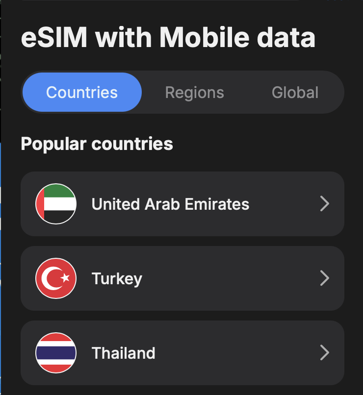
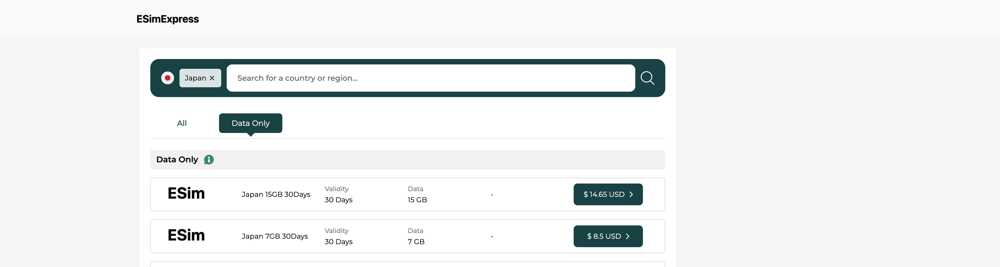

# Правки 

- Сделать перевод видимых страниц на Русский 
- Нарисовать емкий логотип eSimExpress
- Для мобильной версии поменять верстку карточек стран с квадратов на плоские, отобразить списком как у https://t.me/Mobile (Флаг - название страны - цена)

- Сделать цветовую схему по аналогу с https://t.me/Mobile используя темно-синие цвета, чтобы переход в бота был плавным и сохранялось ощущение что пользователь остается в рамках сайта, а бот является продолжение покупки @eSIMExpressBot 
- В хедере разместить логотип ESimExpress (слева), поиск по странам (середина) и справа - кнопку или иконку перехода в бот @eSIMExpressBot
- Поменять категории переключения (#eSimTabs src/app/components/esim-countries/esim-countries.component.html) на Популярные | Локальные | Региональные | Мировые
- Убрать вертикальный скролл в #eSimTabs src/app/components/esim-countries/esim-countries.component.html
- Отцентровать контейнер с перечислением пакетов по определенной стране (напр выбираем страну Italy - http://localhost:4200/esim/Italy, src/app/esim/esim.component.html) 

- В компоненте src/app/components/app-widget/app-widget.component.html сделать дизайн картинок из бота https://t.me/eSIMExpressBot

